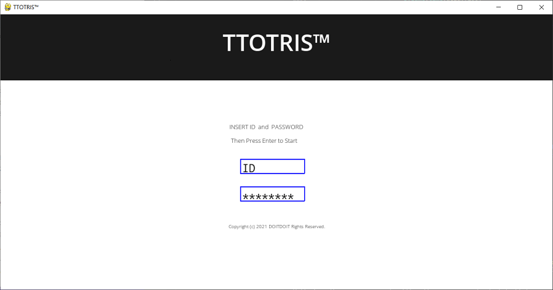
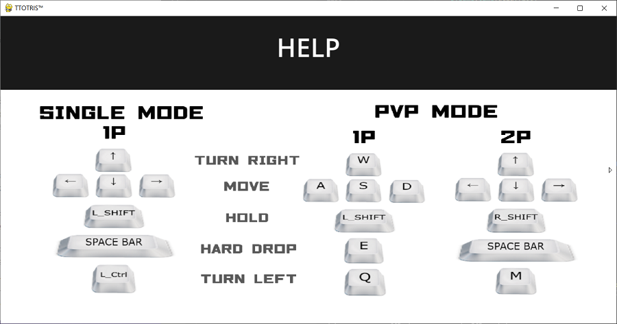
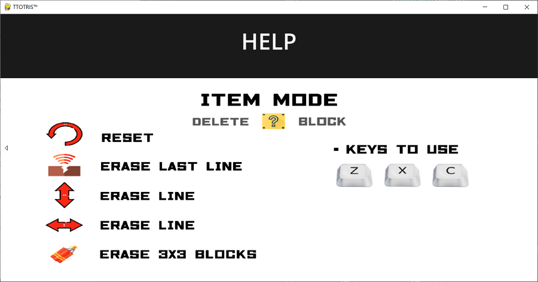

# 2021-2-OSSProj-DoitDoit-2


pygame 활용 테트리스 게임 **"TTOTRIS"**  
(original source: [PINTRIS](https://github.com/CSID-DGU/2021-1-OSSPC-Pint-9))


**2조 두잇두잇**  
**팀장**: [고명섭](https://github.com/tead1234)  
**팀원**: [고다희](https://github.com/DaheeKo), [김수빈](https://github.com/sb0702)


## TTOTRIS



## 실행 방법
1. python, pygame, pymysql 설치
```
sudo apt-get update
sudo apt install python3.8
pip3 install pygame==2.0.2
pip3 install pymysql
```
2. 저장소 클론 및 실행
```
git clone https://github.com/CSID-DGU/2021-2-OSSProj-DoitDoit-2.git
cd Ttotris
python3 Ttotris.py
```


## 주요 변경 사항
* 기존 기능 개선
  * Hard Mode 장애물 구현
  * Fever time 방식 변경
  * PvP Mode 플레이어 별 Soft Drop 구현
  
* 새 기능 추가
  * 로그인 기능
  * 기록 AWS 연동
  * 모드 별 시작 속도 조절 기능
  * Item Mode 추가


## 게임 조작 방법
* 키조작 

 

* 아이템 설명




## 모드 설명 
(모드 이미지들)


## Credits:
- __Sounds__ : https://opengameart.org/content/happy-arcade-tune
- __Images__ :
  - __Item__ : https://www.flaticon.com/free-icon/earthquake_1536249 <br> https://www.flaticon.com/premium-icon/dynamite_2280459 <br> https://www.flaticon.com/free-icon/undo_1574360 <br> https://www.flaticon.com/free-icon/earthquake_1536249 <br> https://www.flaticon.com/free-icon/double-arrow_1573978 <br> All designed by Freepik from Flaticon
  - __Hard__ : https://www.pngegg.com/ko/png-zmaqj
<br>


## References:
- http://www.pygame.org/docs
- https://github.com/CSID-DGU/2019-2-OSSPC-OSO_OSEYO-5/tree/master/tetris
- https://github.com/CSID-DGU/2021-1-OSSPC-BINSU-7/tree/main/PBSPYTRIS
